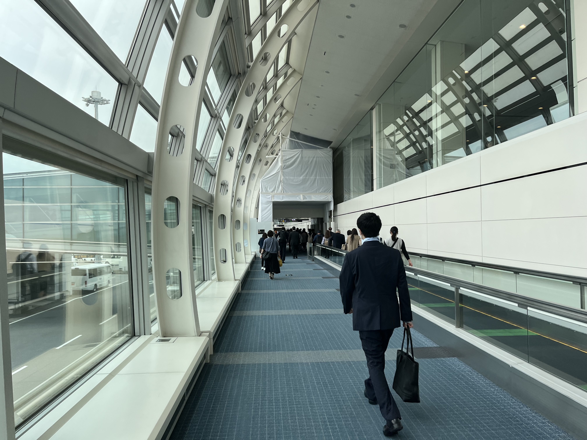
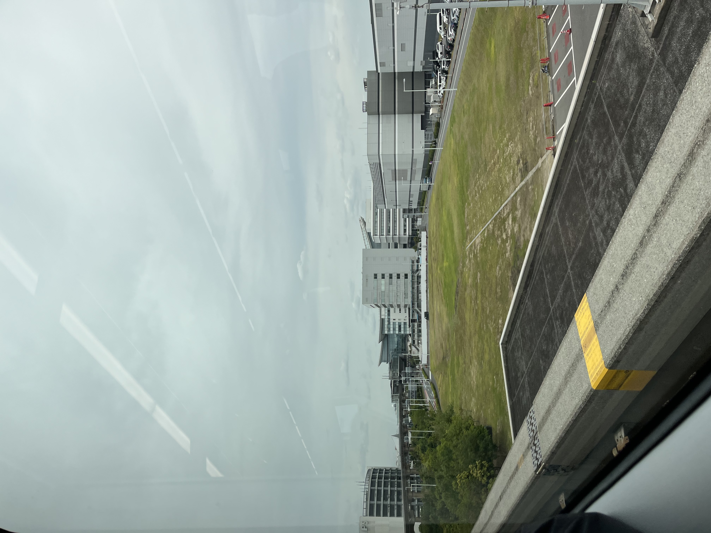

# Day 1
## [Home](README.md)
## Arrival Time: 10:35 a.m.
### Off-boarding from plane
* Entering Tokyo from HND Airport

* 
*  

### Going to hotel

* Waiting train

* Route token

* Taking Monorail to Ikebukuro

* Arrived Ikebukuro

After putting down luggage and everything in Hotel Metropolitan Tokyo Ikebukuro, we started going to Asakusa Temple 浅草寺 area, but before we visit the temple, a sukiyaki lunch was booked.

### Asakusa

#### Sukiyaki lunch

update